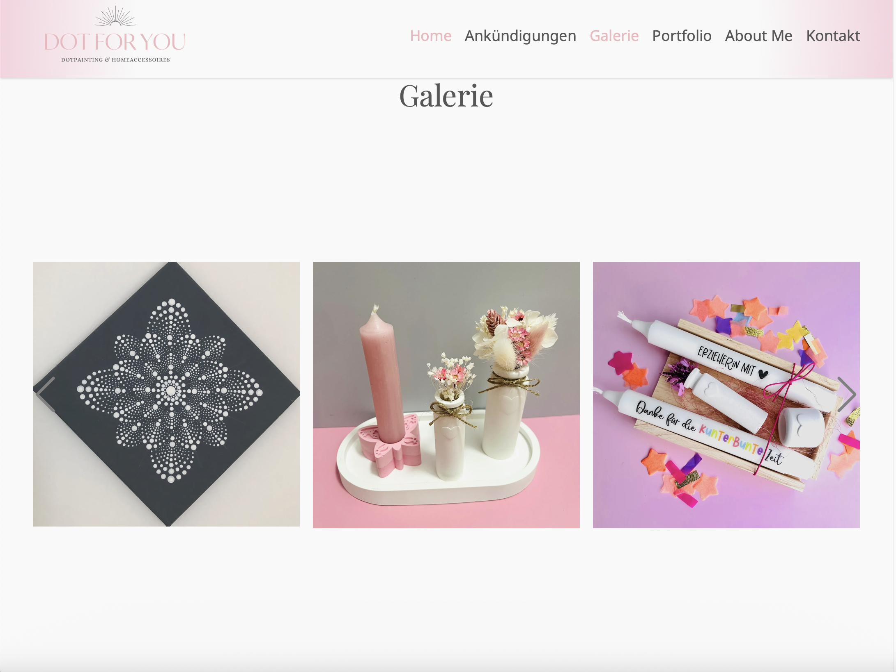

# Dot For You

## Overview

_Dot For You_ is a component based Nuxt web application styled with Tailwind for displaying the Portfolio of my wife's craftsmanship.

## Technologies

_TypeScript_ | _Nuxt_ | _Tailwind_ | _Swiper_

## Images




## Usage

### Prerequisites

- Node
- NPM

(See: https://docs.npmjs.com/downloading-and-installing-node-js-and-npm)

### Installation

1. Clone this repository:
   ```bash
   git clone https://github.com/chris-prenissl/dot-for-you.git
   ```
2. Install all dependencies:
   ```bash
   npm install
   ```
   
3. Run the server:
   ```bash
   npm run dev
   ```

4. Open the browser with the provided url:
   ```bash
   http://localhost:3000
   ```

## License

This project is licensed under a custom License with restriction for commercial use - see the [LICENSE](LICENSE) file for details.
